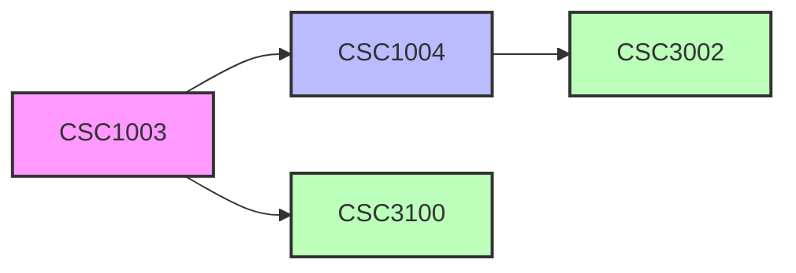

# Design Your CS RoadMap in CUHKSZ

This is the GitBook for CUHKSZ CS RoadMap.

Feel free to raise issues or open a PR. Any valuable contribution is welcomed.

```mermaid
graph LR
    CSC1003[CSC1003] --> CSC1004[CSC1004]
    CSC1004 --> CSC3002[CSC3002]
    CSC1003 --> CSC3100[CSC3100]

    %% Styling
    style CSC1003 fill:#f9f,stroke:#333,stroke-width:2px
    style CSC1004 fill:#bbf,stroke:#333,stroke-width:2px
    style CSC3002 fill:#bfb,stroke:#333,stroke-width:2px
    style CSC3100 fill:#bfb,stroke:#333,stroke-width:2px
```
